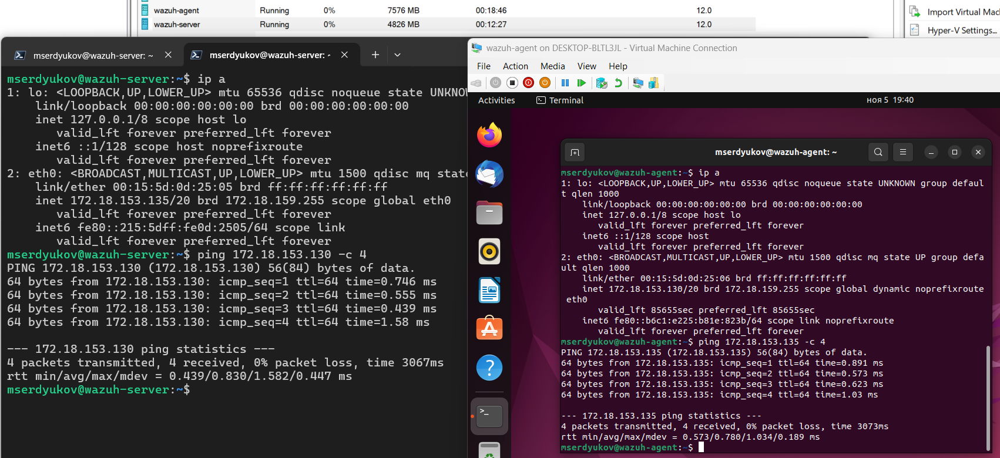
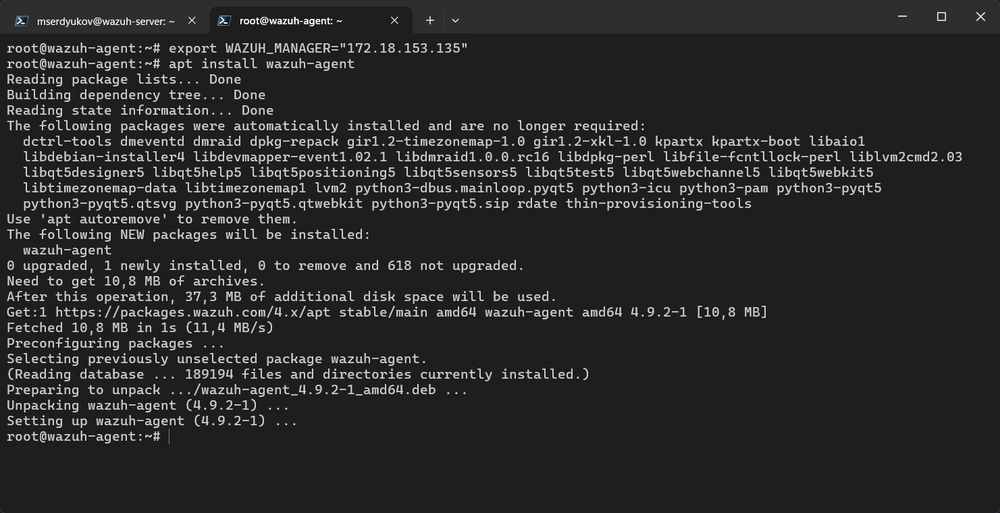
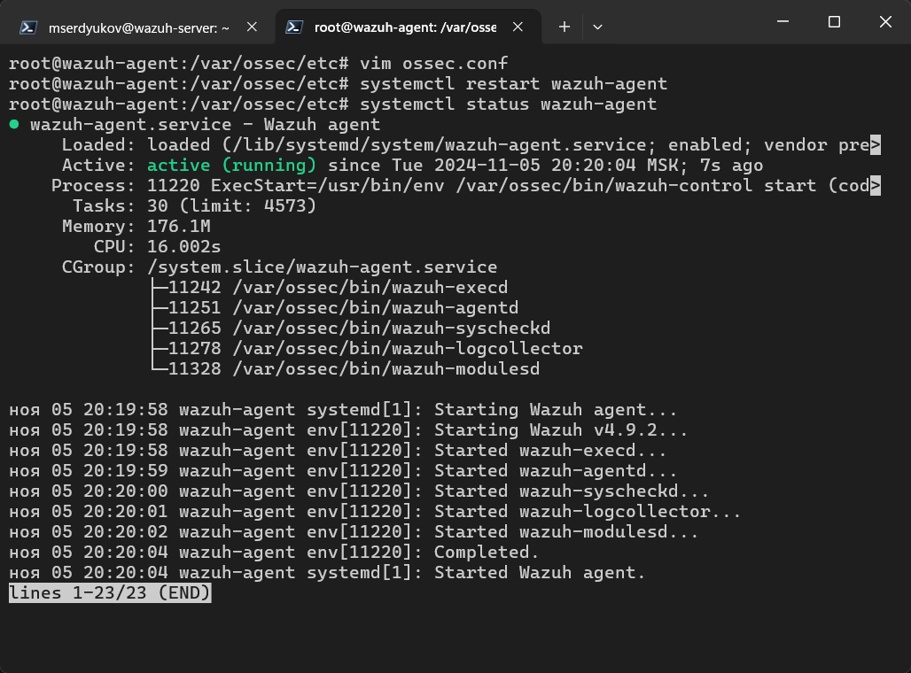
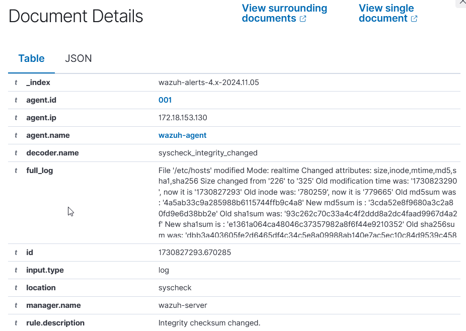
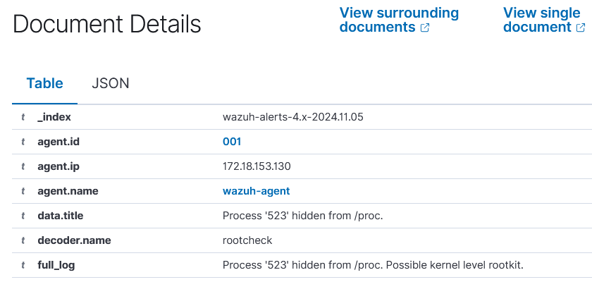
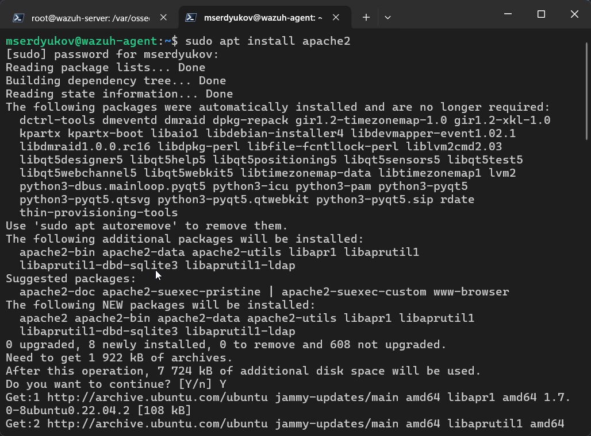
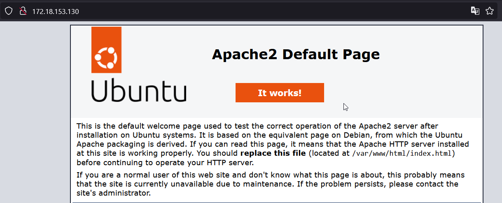
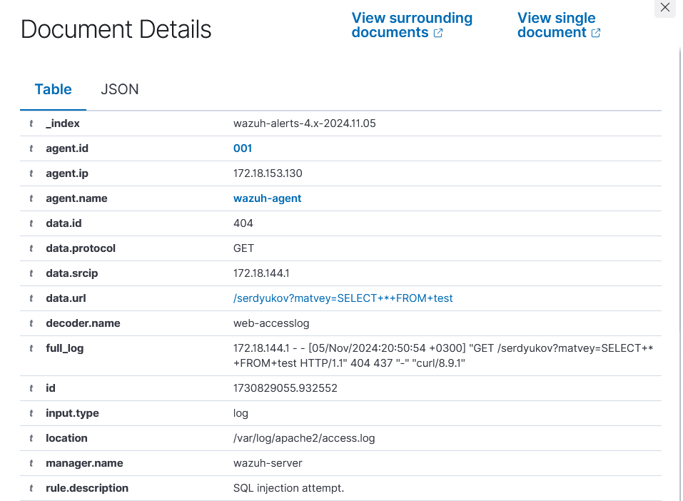
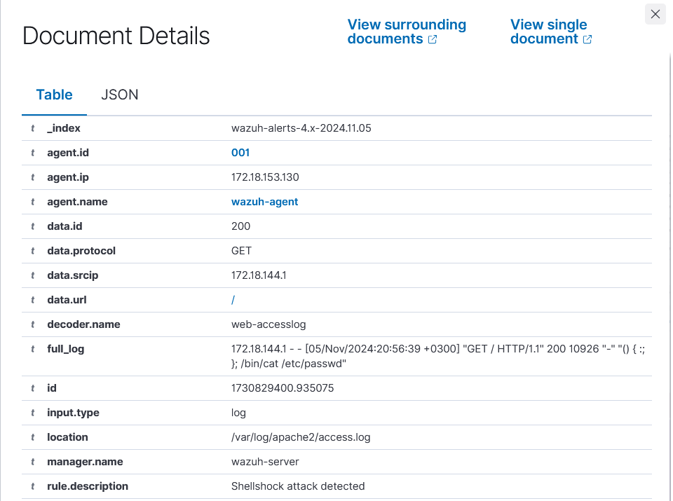

# Практическая работа №3. Wazuh

Выполнил Сердюков Матвей, ББМО-01-23

## Подготовка стенда, создание виртуальных машин

## Установка сервера Wazuh

## Установка агента Wazuh

## Подключенный агент в дашборде

## Найденные уязвимости в конфигурации по умолчанию

## Настройка проверки целостности файлов

### Изменение конфигурационного файла `/etc/hosts`

### Срабатывание правила

## Настройка проверки уязвимостей

## Настройка выявления скрытых процессов

### Установка необходимых пакетов

### Настройка мониторинга процессов в агенте Wazuh

### Сборка и запуск руткита

### Использование руткита для скрытия процесса

### Срабатывание правила

## Настройка выявления SQL-инъекций

### Установка веб-сервера Apache

### Конфигурация мониторинга логов Apache

### Демонстрационная атака

### Срабатывание правила

## Проверка выявления атаки Shellshock

